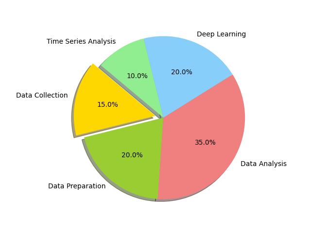

## Hi everyone 👋
I'm Elige Bader, a Data Analyst/Scientist from Lake Forest, CA. I'm a graduate from LearningFuze with a Certificate in Data Science. I've worked on various projects involving data analysis, machine learning, and predictive modeling. I have 2 years of experience in web development and more than 3 years in compensation analysis. I'm passionate about leveraging data to uncover insights and drive decision-making. Feel free to contact me if you have any questions or if you're interested in collaborating!

## 📫 Contact Me
- 👥 [LinkedIn](https://www.linkedin.com/in/elige-bader)
- ✉️ [Email](mailto:eligebader12@gmail.com)
- 🐱 [GitHub](https://github.com/EligeBader)
- 📄 [Resume](Elige_Bader_Resume.pdf)

## 📚 Skills
- **Programming Languages:** 
- **Data Analysis & Visualization:**     
- **Machine Learning & Modeling:**     
- **Statistical Analysis:**  
- **Big Data Technologies:**   
- **Data Wrangling & Preprocessing:**  
- **Development Tools:**  

## 🔍 Projects Overview
### Data Collection
- Utilized various methods and tools to gather data from diverse sources, ensuring the comprehensiveness and accuracy of the collected datasets, including web scraping.

### Data Preparation
- Focused on cleaning, transforming, and preparing data for analysis.
  - Handled missing values, bad values, data types
  - Normalized data and performed feature engineering to make the data analysis-ready

### Data Analysis
- Applied both supervised and unsupervised machine learning techniques to solve various problems:
  - **Classification:** Implemented various classification algorithms using Scikit-Learn, PyTorch, and TensorFlow to predict categorical outcomes.
  - **Linear Regression:** Developed regression models to predict continuous outcomes using libraries like Scikit-Learn and TensorFlow for model training and evaluation.
  - **Clustering:** Applied clustering techniques, such as K-Means and Hierarchical Clustering, to group similar data points. Utilized Scikit-Learn and Pandas for clustering analysis.
  - **Dimensionality Reduction:** Applied techniques like PCA (Principal Component Analysis) to reduce the dimensionality of large datasets while preserving their important structures.

### Deep Learning
- Worked on deep learning projects involving building and training neural networks.
  - Leveraged frameworks like PyTorch and TensorFlow to create and optimize deep learning models
  - Implemented Convolutional Neural Networks (CNNs) for image recognition and classification tasks

### Time Series Analysis
- Analyzed time series data to forecast future trends and patterns
  - Used techniques such as ARIMA and LSTM models for time series forecasting

## 📊 Graph of Results
Below is a graphical representation that visualizes how my time is distributed across the different data science activities:

## 💡 Projects with My Work

### 🚀 Explore My Projects!
- **🏠 House Prices - Regression Techniques:** [Check it out!](https://github.com/EligeBader/Linear-Regression-Project---Housing-Prices)
  - Predicting house prices one regression model at a time!

- **🏦 Home Credit Default Risk - Classification Techniques:** [Discover more!](link-to-your-home-credit-default-risk-project)
  - Classifying credit risks to make lending safer and smarter.

- **📚 Recommender Systems - Amazon Product Recommendations:** [See it in action!](link-to-your-recommender-systems-project)
  - Get personalized book recommendations and make your reading list endless!

- **📸 Deep Learning Project - Image Classification:** [Dive in!](link-to-your-image-classification-project)
  - Identifying objects in images with the power of CNNs.

- **🧠 LLM Classification Finetuning:** [Explore now!](link)
  - Fine-tuning language models to understand and classify like a pro.

## 🏆 Achievements and Certifications
- Python for Data Science and AI, Coursera, 09/26/24
- Excel Essentials for Data Analytics, Coursera, 08/29/24
- Data Analytics Essentials, Coursera, 08/23/24
- Master Google Sheets, Udemy, 08/01/24
- Workday Basics and Beyond Basics, Coursera, 08/01/24
- Human Resources: Compensation and Benefits, LinkedIn Learning, 07/01/24
- Artificial Intelligence and Business Strategy, LinkedIn Learning, 07/01/24

